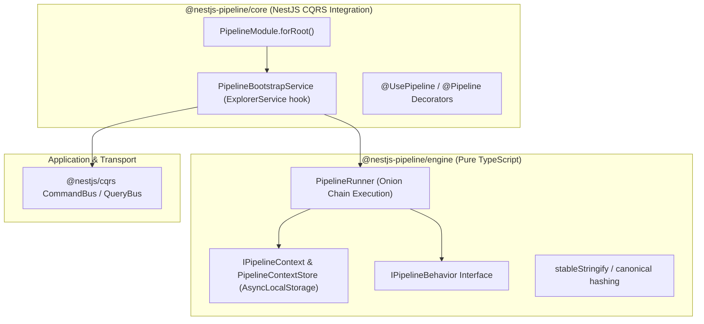

# Consolidated Architecture & Code Review: `nestjs-pipeline`

**Document Version:** 1.0 (Final Synthesis)  
**Date:** September 2026  
**Target:** `nestjs-pipeline` monorepo (`@nestjs-pipeline/*`, `@nestjs-pipeline/ddd-core`, `@nestjs-pipeline/ddd-users-api`)  
**Commit Evaluated:** `master` / `develop` (HEAD: `24029e1` and working tree)  
**Synthesized Inputs:**  
- [`docs/reviews/Intstractions.md`](file:///home/aristotelis/Source/nestjs-pipeline/docs/reviews/Intstractions.md) (Review Specification & Standards)  
- [`docs/reviews/ChatGPT.Review.md`](file:///home/aristotelis/Source/nestjs-pipeline/docs/reviews/ChatGPT.Review.md) (Focus: Application Boundaries, Auth, CQRS Event Side-Effects)  
- [`docs/reviews/Gemini.Review.md`](file:///home/aristotelis/Source/nestjs-pipeline/docs/reviews/Gemini.Review.md) (Focus: Pipeline Behaviors, Core Concurrency, Cache Serialization, Entity Encapsulation)  
- Authoritative repository rules: [`.agents/skills/nestjs-pipeline-architecture/SKILL.md`](file:///home/aristotelis/Source/nestjs-pipeline/.agents/skills/nestjs-pipeline-architecture/SKILL.md) and [`AGENTS.md`](file:///home/aristotelis/Source/nestjs-pipeline/AGENTS.md)

---

## 1. Executive Summary & Monorepo State

### 1.1 Codebase Health & Context of This Review
The `nestjs-pipeline` repository is an advanced, production-grade TypeScript monorepo providing MediatR-style pipeline behaviors for `@nestjs/cqrs`, an opinionated DDD/Clean Architecture core, and a multi-tenant reference application (`ddd-users-api`). All 74 test files (354 unit/integration tests) pass cleanly.

A critical finding from analyzing the historical commits (`ae9f820` through `24029e1`) is that **the repository has been rapidly evolving to address earlier architectural feedback**:
- `UserLoginService` has already been stripped of Fastify, JOSE, and `process.env` dependencies via dedicated application ports (`ILoginCodeVerifier`, `IAccessTokenIssuer`).
- CQRS event handlers (`UserCreatedHandler`, `UserUpdatedHandler`) have already been decoupled from BullMQ via `IWelcomeEmailDispatcher` and `IUserBatchDispatcher`.
- Multi-tenancy has been decoupled from direct persistence contexts via `ITenantContext` and `EntityManagerTenantRegistry`.
- `JwtAuthenticator` no longer marks `authQueryRepository` as `@Optional()`, eliminating the silent revocation fail-open hazard.
- `CaslUserContextResolver` has been split from `GetUserContextQueryRepository`, introducing an explicit `PrincipalType` (`'user' | 'service'`).

However, synthesizing both external reviews against the current repository state reveals that **several fundamental architectural leaks, concurrency hazards, and subtle encapsulation breaches remain unresolved**. These are primarily concentrated in:
1. **The Pipeline-CASL package boundary** (leaking NestJS HTTP exceptions).
2. **Persistence concurrency & optimistic locking** (missing version checks on delete, and stale persisted version baselines).
3. **Domain model encapsulation** (public mutating setters and live aggregate references on domain events).
4. **Cache contract divergences** (`MemoryCache` reference aliasing vs. distributed snapshot hydration).
5. **Implicit lifecycle triggers** (`CommandBaseHandler` event publication tied to controller response shape).

---

### 1.2 State Ledger: Resolved vs. Active vs. Intentional

To ensure this review serves as an authoritative and accurate engineering blueprint, we explicitly categorize issues into three states:

```mermaid
graph TD
  subgraph Historically Reported but ALREADY RESOLVED
    R1["UserLoginService Boundary Collapse<br/>(Decoupled via ILoginCodeVerifier / IAccessTokenIssuer)"]
    R2["Event Handlers BullMQ Coupling<br/>(Decoupled via IWelcomeEmailDispatcher)"]
    R3["JwtAuthenticator Optional Revocation<br/>(authQueryRepository made required)"]
    R4["CASL Resolver UUID Heuristic<br/>(Split resolver & PrincipalType discriminator)"]
    R5["Persistence Retry Leaks in Handlers<br/>(TransientOperationError introduced)"]
  end

  subgraph GENUINE ACTIVE DEFECTS (This Review)
    D1["CaslBehavior ForbiddenException Leak"]
    D2["DeleteCommandRepositories Missing Optimistic Lock"]
    D3["Stale _persistedVersion Baseline After Save"]
    D4["RootEntity Public Mutating Setters"]
    D5["RootDomainEvent Live Mutable Aggregate Reference"]
    D6["MemoryCache vs MikroOrmCache Hydration Mismatch"]
    D7["CommandBaseHandler Event Publication Tied to Return Shape"]
    D8["Zod Property Asymmetry & Sync Parse Crash"]
    D9["Resilience Telemetry Contamination on Multi-Event Handlers"]
    D10["Static PIPELINE_OPTIONS_REGISTRY Memory Leak"]
  end

  subgraph INTENTIONAL ARCHITECTURAL DECISIONS (Preserve)
    K1["Private NestJS CQRS Explorer Hook in Bootstrap"]
    K2["Global PipelineModule with Feature Scoping"]
    K3["Cross-Cutting Packages Family Conventions"]
    K4["Zod In-Place Request Mutation"]
    K5["Post-Materialization Entity Authorization"]
  end
```

---

## 2. Intentional Architectural Decisions to Keep Untouched

Per `Intstractions.md` and repository guidelines, the following patterns are deliberate engineering trade-offs and **must NOT be dismantled**:

1. **NestJS / CQRS Bootstrap Coupling in `PipelineBootstrapService`**:
   - *Rationale*: Intercepting CQRS dispatch via `ExplorerService` prototype wrapping enables seamless zero-boilerplate behavior pipelines without forcing every command/query handler to implement custom wrapper classes.
   - *Decision*: Keep this coupling contained within `@nestjs-pipeline/core`. Do not replace it with a hand-rolled framework-neutral dispatcher that sacrifices Nest DI ergonomics.
2. **Global `PipelineModule` Semantics**:
   - *Rationale*: Behaviors like logging, tracing, correlation, and dead-lettering are enterprise-wide cross-cutting concerns.
   - *Decision*: Keep `PipelineModule` global; `forFeature()` remains organizational rather than introducing fractured DI container scopes.
3. **Behavior-per-Concern Package Family Structure**:
   - *Rationale*: Packages (`audit`, `cache`, `resilience`, `rate-limit`, `feature-flags`, `deadletter`, `idempotency`) share similar configuration merging conventions.
   - *Decision*: Do not consolidate these into an over-engineered monolithic "middleware framework". Narrow, single-purpose packages are easier to version, tree-shake, and adopt incrementally.
4. **Zod In-Place Request Mutation**:
   - *Rationale*: CQRS message instances must preserve object identity across the execution pipeline while applying schema defaults and coerced values.
   - *Decision*: Maintain in-place mutation of validated properties; replacing the request instance breaks reference equality in downstream handlers and correlation stores.
5. **Post-Materialization Authorization in Query Handlers**:
   - *Rationale*: Authorizing aggregates after hydration from persistence (e.g. in `GetUserHandler`) ensures that permissions are evaluated against authoritative business state, avoiding the security anti-pattern of embedding authorization rules inside database queries.

---

## 3. Prioritized Implementation Blueprint: Active Findings

---

### Finding 1: Direct `HttpException` (`ForbiddenException`) Thrown in `CaslBehavior`
- **Severity**: **CRITICAL**
- **Category**: Leaky Abstraction / Architecture Violation
- **Package**: `@nestjs-pipeline/casl`
- **Locations**: 
  - [`packages/pipeline-casl/src/casl.behavior.ts:526`](file:///home/aristotelis/Source/nestjs-pipeline/packages/pipeline-casl/src/casl.behavior.ts#L526)
  - [`packages/pipeline-casl/src/casl.behavior.ts:713`](file:///home/aristotelis/Source/nestjs-pipeline/packages/pipeline-casl/src/casl.behavior.ts#L713)

#### Problem & Architectural Impact
`CaslBehavior` imports and throws NestJS's HTTP-specific `ForbiddenException`:
```ts
throw new ForbiddenException(
  `Access denied: missing ability for action "${firstFailed.action}" on subject "${subjectName}".`,
);
```
- **Violates Rule 2 & 4** of `AGENTS.md` and `.agents/skills/nestjs-pipeline-architecture/SKILL.md`: *"Do not throw Nest HttpException subclasses from domain or application/CQRS code; map framework-neutral errors at the presentation boundary."*
- **Breaks Transport Neutrality**: The pipeline executes CQRS commands and events triggered by non-HTTP transports (BullMQ background workers, Kafka consumers, WebSocket gateways, CLI scripts). Throwing an HTTP 403 exception inside a background queue worker forces non-HTTP consumers to catch HTTP exceptions.
- **Inconsistent with the Rest of the Repository**: `@nestjs-pipeline/casl` already defines a framework-neutral [`UnauthorizedActionException extends Error`](file:///home/aristotelis/Source/nestjs-pipeline/packages/pipeline-casl/src/unauthorized-action.exception.ts), and presentation filters ([`UnauthorizedActionFilter`](file:///home/aristotelis/Source/nestjs-pipeline/ddd/users-api/src/common/filters/unauthorized-action.filter.ts)) already map it to HTTP 403. All other pipeline packages (`feature-flags`, `rate-limit`, `idempotency`, `zod`) throw framework-neutral `Error` subclasses.

#### Concrete Solution
Replace all `ForbiddenException` throws in `CaslBehavior` with `UnauthorizedActionException`:
```ts
// packages/pipeline-casl/src/casl.behavior.ts
import { UnauthorizedActionException } from './unauthorized-action.exception';

// Inside handle():
if (!contextUser) {
  throw new UnauthorizedActionException(
    'Access denied: user context is required but was not resolved.',
  );
}

// And on failed ability verification:
throw new UnauthorizedActionException(
  `Access denied: missing ability for action "${firstFailed.action}" on subject "${subjectName}".`,
);
```

#### Migration & Testing
- Update unit tests in `casl.behavior.spec.ts` and `casl.behavior.integration.spec.ts` to expect `UnauthorizedActionException`.
- Verify that `users-api` controllers continue returning HTTP 403 via `UnauthorizedActionFilter`.

---

### Finding 2: Unconditional Deletion Without Optimistic Lock Check
- **Severity**: **HIGH**
- **Category**: Correctness / Concurrency / Lost Updates
- **Package**: `@nestjs-pipeline/ddd-users-api`
- **Locations**:
  - [`ddd/users-api/src/users/persistence/delete-user.command-repository.ts:46`](file:///home/aristotelis/Source/nestjs-pipeline/ddd/users-api/src/users/persistence/delete-user.command-repository.ts#L46)
  - [`ddd/users-api/src/roles/persistence/delete-role.command-repository.ts:45`](file:///home/aristotelis/Source/nestjs-pipeline/ddd/users-api/src/roles/persistence/delete-role.command-repository.ts#L45)

#### Problem & Architectural Impact
In `UpdateUserCommandRepository`, optimistic concurrency is strictly enforced:
```ts
const affected = await this.store.em.nativeUpdate(
  User,
  { id: user.id, version: user.getExpectedVersion() },
  { ... }
);
if (affected === 0) throw OptimisticLockError.lockFailedVersionMismatch(...);
```
However, in `DeleteUserCommandRepository` (and `DeleteRoleCommandRepository`), deletion is executed unconditionally:
```ts
await this.store.em.nativeDelete(User, user.id);
```
- **Lost Update on Concurrent Mutation**: If User A reads an entity at `version: 1` to delete it, while User B concurrently updates that entity to `version: 2` (e.g. updating compliance settings or billing data), User A's delete unconditionally deletes the entity at `version: 2`.
- In enterprise DDD applications, deleting an aggregate is a mutating state transition that must verify the caller's expected version matches the current persisted version.

#### Concrete Solution
Pass `{ id: user.id, version: user.getExpectedVersion() }` to `nativeDelete` and verify the affected row count:
```ts
// ddd/users-api/src/users/persistence/delete-user.command-repository.ts
async save(user: User): Promise<null> {
  try {
    const affected = await this.store.em.nativeDelete(User, {
      id: user.id,
      version: user.getExpectedVersion(),
    });

    if (affected === 0) {
      const exists = await this.store.em.findOne(User, { id: user.id }, { refresh: true });
      if (exists) {
        throw OptimisticLockError.lockFailedVersionMismatch(
          user,
          user.getExpectedVersion(),
          exists.version,
        );
      }
      throw OptimisticLockError.lockFailedEntityNotFound(user, user.getExpectedVersion());
    }
    return null;
  } catch (error) {
    if (error instanceof OptimisticLockError) throw error;
    throw mapPersistenceError(error, `deleting User ${user.id}`);
  }
}
```

---

### Finding 3: Stale `_persistedVersion` Baseline After Successful Save
- **Severity**: **HIGH**
- **Category**: Correctness / Aggregate Lifecycle / Concurrency
- **Package**: `@nestjs-pipeline/ddd-core` & `@nestjs-pipeline/ddd-users-api`
- **Locations**:
  - [`ddd/core/domain/models/root.entity.ts:102, 233`](file:///home/aristotelis/Source/nestjs-pipeline/ddd/core/domain/models/root.entity.ts#L102)
  - [`ddd/users-api/src/users/persistence/update-user.command-repository.ts:40-50`](file:///home/aristotelis/Source/nestjs-pipeline/ddd/users-api/src/users/persistence/update-user.command-repository.ts#L40)
  - [`ddd/users-api/src/roles/persistence/update-role.command-repository.ts:39-49`](file:///home/aristotelis/Source/nestjs-pipeline/ddd/users-api/src/roles/persistence/update-role.command-repository.ts#L39)

#### Problem & Architectural Impact
`RootEntity` maintains `_version` (current in-memory version) and `_persistedVersion` (the version persistence must compare against in `WHERE version = expected`).
When an aggregate mutates, `onUpdate()` increments `_version` from 1 to 2, while `_persistedVersion` remains 1.
When `UpdateUserCommandRepository.save(user)` succeeds, it updates the database to `version: 2`. **However, it never notifies the aggregate that persistence succeeded.**
- `user._persistedVersion` remains 1.
- If the same aggregate instance is saved again in a multi-step workflow, or if downstream logic calls `user.getExpectedVersion()`, it returns 1 instead of 2.
- A subsequent save will compare `WHERE version = 1` against the database (which is now at 2) and throw an `OptimisticLockError` against its own previous write!

#### Concrete Solution
Add a formal lifecycle acknowledgment method `markPersisted()` to `RootEntity`, called by command repositories immediately upon successful database write:
```ts
// ddd/core/domain/models/root.entity.ts
export abstract class RootEntity<TSnapshot extends Partial<RootEntitySnapshot>> {
  /** Acknowledges that the current in-memory version has been successfully persisted. */
  public markPersisted(): void {
    this._persistedVersion = this._version;
  }
}

// ddd/users-api/src/users/persistence/update-user.command-repository.ts
async save(user: User): Promise<UserSnapshot> {
  const affected = await this.store.em.nativeUpdate(User, ...);
  if (affected === 0) { ... }
  
  user.markPersisted(); // <-- Advance the persistence baseline
  return user.toJSON();
}
```

---

### Finding 4: Domain Event Publication Tied to Handler Return Shape
- **Severity**: **HIGH**
- **Category**: DDD / CQRS / Hidden Lifecycle Contracts
- **Package**: `@nestjs-pipeline/ddd-core`
- **Location**: [`ddd/core/application/command-base.handler.ts:129-145`](file:///home/aristotelis/Source/nestjs-pipeline/ddd/core/application/command-base.handler.ts#L129)

#### Problem & Architectural Impact
`CommandBaseHandler.execute()` automatically publishes events by inspecting the returned value:
```ts
const commandResult = await this.handle(command as TCommand);

if (commandResult instanceof AggregateRoot) {
  this.commit(commandResult);
} else if (commandResult && 'aggregate' in commandResult && commandResult.aggregate instanceof AggregateRoot) {
  this.commit(commandResult.aggregate);
}
```
- **Dangerous Hidden Coupling**: Application response shape and domain event publication are two completely different concerns. If an engineer refactors a command handler from `return user;` to `return mapper.toResponseDto(user);` or `return user.id;`, **event publication silently stops**.
- The TypeScript compiler cannot detect this failure.
- If a command mutates two aggregates within one transaction, only one can be returned, forcing manual calls to `this.commit(agg2)`.
- This conflicts with `AGENTS.md` Rule 8 ("Follow CommandBaseHandler event-publication semantics... do not duplicate event publication").

#### Concrete Solution
Decouple publication from the controller return shape. Provide an explicit command result envelope or register modified aggregates through a command execution context:
```ts
// ddd/core/application/command-base.handler.ts
export interface CommandExecutionResult<TResponse> {
  response: TResponse;
  aggregates?: readonly AggregateRoot[];
}

// In execute():
const result = await this.handle(command as TCommand);

if (this.isExecutionEnvelope(result)) {
  for (const agg of result.aggregates ?? []) {
    this.commit(agg);
  }
  return result.response;
}

if (result instanceof AggregateRoot) {
  this.commit(result);
  return result;
}
```

---

### Finding 5: Public Mutating Setters on Immutable Identity Fields in `RootEntity`
- **Severity**: **HIGH**
- **Category**: Domain Model Encapsulation / DDD Purity
- **Package**: `@nestjs-pipeline/ddd-core`
- **Location**: [`ddd/core/domain/models/root.entity.ts:215-231`](file:///home/aristotelis/Source/nestjs-pipeline/ddd/core/domain/models/root.entity.ts#L215)

#### Problem & Architectural Impact
`RootEntity` exposes public mutating setters:
```ts
get id(): string { return this._id; }
set id(value: string) { this._id = RootEntity.normalizeId(value); }

get createdAt(): Date { return new Date(this._createdAt); }
set createdAt(value: Date | string) { this._createdAt = RootEntity.normalizeDate(value); }

get updatedAt(): Date { return new Date(this._updatedAt); }
set updatedAt(value: Date | string) { this._updatedAt = RootEntity.normalizeDate(value); }
```
- **Violates Rule 6** of `AGENTS.md`: *"Mutate aggregates through factories/domain methods, not direct setters or synthetic snapshots constructed only to trigger persistence."*
- An aggregate root's identity (`id`) and audit timestamp (`createdAt`) are immutable. Exposing public setters allows arbitrary application code to execute `user.id = 'hijacked'` or modify audit timestamps without triggering `onUpdate()` or incrementing versions.
- Note: Also, `new User()`, `new Role()`, and `new Auth()` expose unconstrained public zero-argument constructors that create invalid entities with empty strings purely for ORM reflection.

#### Concrete Solution
1. Remove public setters for `id` and `createdAt`. Keep `updatedAt` mutated only via `protected onUpdate()`.
2. Provide a protected rehydration hook or use the existing `fromJSON()` factory method for ORM rehydration.
3. Make zero-argument constructors protected or private, requiring construction via `create()` or `reconstitute()` / `fromJSON()`.
```ts
// ddd/core/domain/models/root.entity.ts
export abstract class RootEntity<TSnapshot extends Partial<RootEntitySnapshot>> {
  get id(): string { return this._id; }
  get createdAt(): Date { return new Date(this._createdAt); }
  get updatedAt(): Date { return new Date(this._updatedAt); }

  // No public setters for id, createdAt, or updatedAt
}
```

---

### Finding 6: Domain Events Carry Live Mutable Aggregate References
- **Severity**: **HIGH**
- **Category**: Concurrency / Temporal Coupling / Event Immutability
- **Package**: `@nestjs-pipeline/ddd-core`
- **Location**: [`ddd/core/domain/events/root-domain.event.ts:174-180`](file:///home/aristotelis/Source/nestjs-pipeline/ddd/core/domain/events/root-domain.event.ts#L174)

#### Problem & Architectural Impact
`RootDomainEvent` carefully performs `deepCloneAndFreeze(rawPayload)` to ensure `payload` is completely immutable. However:
```ts
export class RootDomainEvent<T, TPayload> extends DomainEvent {
  public readonly entity: T; // <-- Holds live in-memory aggregate instance!
  public readonly payload: Readonly<TPayload>;
}
```
- While `payload` is frozen, `event.entity` exposes the live, mutable aggregate root instance.
- **Race Condition in Async Handlers**: If an event handler processes `RootDomainEvent` asynchronously, inspecting `event.entity` reads the *current mutable state* rather than the state at the moment the event was raised.
- Event consumers could inadvertently invoke mutating domain methods (`event.entity.suspend()`) outside a command handler.

#### Concrete Solution
Deprecate direct access to `event.entity`. Events should be self-contained immutable messages:
```ts
// ddd/core/domain/events/root-domain.event.ts
export class RootDomainEvent<T, TPayload> extends DomainEvent {
  public readonly aggregateId: string;
  public readonly aggregateVersion: number;
  public readonly payload: Readonly<TPayload>;

  /** @deprecated Consume frozen `event.payload` instead of live aggregate instance. */
  public get entity(): Readonly<T> {
    return Object.freeze(this._entityRef);
  }
  private readonly _entityRef: T;
}
```

---

### Finding 7: Cache Hydration Divergence Between `MemoryCache` and Redis (`MikroOrmCache`)
- **Severity**: **HIGH**
- **Category**: Correctness / Data Integrity / Testing Fidelity
- **Package**: `@nestjs-pipeline/ddd-users-api` & `@nestjs-pipeline/ddd-core`
- **Locations**:
  - [`ddd/users-api/src/persistence/cache/memory.cache.ts:45-55`](file:///home/aristotelis/Source/nestjs-pipeline/ddd/users-api/src/persistence/cache/memory.cache.ts#L45)
  - [`ddd/users-api/src/persistence/cache/mikro-orm.cache.ts:35-42`](file:///home/aristotelis/Source/nestjs-pipeline/ddd/users-api/src/persistence/cache/mikro-orm.cache.ts#L35)
  - [`ddd/users-api/src/users/persistence/get-user.query-repository.ts:50-60`](file:///home/aristotelis/Source/nestjs-pipeline/ddd/users-api/src/users/persistence/get-user.query-repository.ts#L50)

#### Problem & Architectural Impact
In `GetUserQueryRepository`:
```ts
@FromCache<UserSnapshot, User>(
  (query) => filterCacheKey(User.aggregateName, query),
  (cached) => User.fromJSON(cached as UserSnapshot),
)
async find(query: GetUserQuery): Promise<User | null> { ... }
```
When `find()` caches the returned `User`:
- `MikroOrmCache` (Redis) runs `JSON.stringify(user)`, storing a JSON string. When retrieved, `cached` is a plain JavaScript object matching `UserSnapshot`.
- `MemoryCache` (used in unit tests and local dev) executes `this.store.set(key, value)`, storing the **raw instantiated `User` object reference**.
- When `MemoryCache` retrieves the item, `@FromCache` passes the instantiated `User` to `User.fromJSON(cached)`. On a `User` instance, version is stored internally as `_version`, not `version`, causing version misalignments and reference aliasing.
- Unit tests run against `MemoryCache` test a fundamentally different code path than production Redis deployments.

#### Concrete Solution
Enforce canonical JSON serialization inside `MemoryCache`:
```ts
// ddd/users-api/src/persistence/cache/memory.cache.ts
export class MemoryCache<T> implements ICache<T> {
  private readonly store = new Map<string, string>(); // Store serialized JSON strings

  async get(key: string): Promise<T | null> {
    const raw = this.store.get(key);
    if (!raw) return null;
    return JSON.parse(raw) as T;
  }

  async set(key: string, value: T, ttl?: number): Promise<void> {
    this.store.set(key, JSON.stringify(value));
  }
}
```

---

### Finding 8: Property Assignment Asymmetry & Synchronous Parse Crash in `createZodRequest`
- **Severity**: **MEDIUM**
- **Category**: Correctness / Package Ergonomics
- **Package**: `@nestjs-pipeline/zod`
- **Locations**:
  - [`packages/pipeline-zod/src/create-zod-request.ts:120-137`](file:///home/aristotelis/Source/nestjs-pipeline/packages/pipeline-zod/src/create-zod-request.ts#L120)
  - [`packages/pipeline-zod/src/zod-validation.behavior.ts:176-184`](file:///home/aristotelis/Source/nestjs-pipeline/packages/pipeline-zod/src/zod-validation.behavior.ts#L176)

#### Problem & Architectural Impact
1. **Asymmetric Undefined Handling**: When a command is created via `new CreateUserCommand(input)`, keys with `undefined` values are skipped (`if (value !== undefined)`). Later, when `ZodValidationBehavior` validates the request, `defineEnumerableDataProperties` copies all keys from `result.data`, setting `target.department = undefined`. Handlers using `'department' in command` observe conflicting results depending on whether the command traversed the pipeline behavior.
2. **Synchronous Constructor Crash on Async Schemas**: `createZodRequest` calls `schema.safeParse(input)` in its constructor. If a developer uses asynchronous refinements (e.g. `z.string().refine(async () => ...)`), `new MyCommand()` throws a synchronous parse error before the pipeline even executes.

#### Concrete Solution
- Harmonize property assignment between `createZodRequest` and `defineEnumerableDataProperties`.
- Guard against async schemas in the constructor, advising use of asynchronous parse factories (`parseAsync`).

---

### Finding 9: Resilience Policy Telemetry Contamination on Multi-Event Handlers
- **Severity**: **MEDIUM**
- **Category**: Observability / Logging Correctness
- **Package**: `@nestjs-pipeline/resilience`
- **Locations**:
  - [`packages/pipeline-resilience/src/helpers/policy-factory.ts:146`](file:///home/aristotelis/Source/nestjs-pipeline/packages/pipeline-resilience/src/helpers/policy-factory.ts#L146)
  - [`packages/pipeline-resilience/src/resilience.behavior.ts:102-117`](file:///home/aristotelis/Source/nestjs-pipeline/packages/pipeline-resilience/src/resilience.behavior.ts#L102)

#### Problem & Architectural Impact
`ResilienceBehavior` caches Cockatiel policies by `context.handlerType`. However, when building the policy, it passes `{ requestName: context.requestName }`, which gets baked into the retry logging closure:
```ts
policy.onRetry(() => ctx.logger?.warn(`[resilience] retrying ${ctx.requestName} → ${ctx.handlerName}`));
```
In `@nestjs/cqrs`, an `@EventsHandler(OrderCreatedEvent, OrderCancelledEvent)` can handle multiple distinct event classes. The first event handled permanently bakes its name into the policy closure. When the second event fails and retries, logs incorrectly report the first event's name.

#### Concrete Solution
Pass `requestName` dynamically through Cockatiel's execution context rather than capturing it in the static policy closure.

---

### Finding 10: Dead Memory Leak Hazard in `PIPELINE_OPTIONS_REGISTRY`
- **Severity**: **MEDIUM**
- **Category**: Performance / Memory Management
- **Package**: `@nestjs-pipeline/core`
- **Location**: [`packages/pipeline/src/decorators/pipeline.decorator.ts:63-79`](file:///home/aristotelis/Source/nestjs-pipeline/packages/pipeline/src/decorators/pipeline.decorator.ts#L63)

#### Problem & Architectural Impact
`pipeline.decorator.ts` maintains an exported global `Map`:
```ts
export const PIPELINE_OPTIONS_REGISTRY = new Map<string, Map<string, Record<string, unknown>>>();
```
Marked `@deprecated` and completely unused during pipeline execution. In long-running processes, watch mode, or multi-tenant microservices, it indefinitely accumulates metadata keyed by `target.name`.

#### Concrete Solution
Deprecate and convert to a no-op, or guard population behind `process.env.DEBUG_PIPELINE_REGISTRY === 'true'`.

---

### Finding 11: Architecture Documentation Drift
- **Severity**: **MEDIUM**
- **Category**: Documentation / Maintainability
- **Files**:
  - [`docs/Architecture.md`](file:///home/aristotelis/Source/nestjs-pipeline/docs/Architecture.md)
  - [`docs/architecture-audit.el.md`](file:///home/aristotelis/Source/nestjs-pipeline/docs/architecture-audit.el.md)

#### Problem & Architectural Impact
Both documents still list several resolved findings as active defects (e.g. claiming mutation commands load from read repositories, or that email cache invalidation is missing in `CreateUserCommandRepository`). Because `AGENTS.md` instructs agents to treat documentation as part of the specification, stale documentation leads agents to propose incorrect refactors.

#### Concrete Solution
Convert `docs/Architecture.md` into a verified status ledger with explicit commit SHAs indicating when findings were resolved.

---

## 4. Architecture Improvement & Framework Decoupling Blueprint

Currently, `@nestjs-pipeline/core` is tightly coupled to `@nestjs/common` and `@nestjs/core` via `Type<T>`, `Injectable()`, `Module()`, and `ExplorerService`.

### 4.1 Target Framework-Agnostic Core Architecture

To achieve true clean architecture and enable pipeline behaviors in non-Nest contexts (e.g. pure Node.js services, Fastify plugins, standalone Lambda handlers, or other DI containers), the pipeline engine should be partitioned into two distinct conceptual layers:



### 4.2 Decoupling Strategy: Where Independence Helps vs. Where It Is Premature
- **High ROI (Decouple Immediately)**:
  - Caching keys, correlation storage, Zod request parsing, and canonical stable serialization. These are pure algorithms that have zero need for `@nestjs/common`.
  - The onion execution loop (`executePipeline(context, behaviors, handler)`).
- **Premature / Low ROI (Keep Nest Coupling)**:
  - Abstracting `@nestjs/cqrs` `CommandBus` or Nest's DI container inside the application layer. The primary purpose of this repository is to supercharge NestJS CQRS applications. Introducing a custom dispatch bus on top of `@nestjs/cqrs` would create unnecessary indirection without real business value.

---

### 4.3 Outbox Pattern for Distributed Reliability
`AGENTS.md` Rule 10 states: *"Do not assume Nest's in-memory EventBus is a transactional outbox. Durable delivery requires an explicit architecture decision."*
- **Recommendation**: Introduce an optional `ITransactionalOutbox` port in `@nestjs-pipeline/ddd-core`.
- In high-reliability deployments, `CommandBaseHandler` can record events into an outbox table within the primary SQL transaction, and a background worker streams them to the EventBus or message broker.

---

### 4.4 Automated Architectural Guardrails
To prevent architectural drift, install automated AST/dependency boundary tests (using `dependency-cruiser` or TypeScript compiler API tests) that assert:
```text
domain/       MUST NOT import: @nestjs/*, @persistence/*, bullmq, jose
application/  MUST NOT import: @persistence/*, bullmq, fastify, jose, HttpException
cqrs/events/  MUST NOT import: bullmq (must use application dispatch ports)
packages/*    MUST NOT import: @nestjs/common HttpException subclasses
```

---

## 5. Master Implementation Roadmap

| Phase | Focus Area | Actions | Primary Files |
| :--- | :--- | :--- | :--- |
| **Phase 1** | **Critical Leaks & Concurrency** | 1. Replace `ForbiddenException` with `UnauthorizedActionException`.<br>2. Add version check to `nativeDelete` in delete repositories.<br>3. Add `markPersisted()` to advance aggregate version baseline after save.<br>4. Decouple event publication from handler return shape.<br>5. Enforce JSON serialization in `MemoryCache`. | `casl.behavior.ts`<br>`delete-user.command-repository.ts`<br>`root.entity.ts`<br>`update-user.command-repository.ts`<br>`command-base.handler.ts`<br>`memory.cache.ts` |
| **Phase 2** | **Domain Encapsulation** | 1. Remove public setters (`id`, `createdAt`, `updatedAt`) from `RootEntity`.<br>2. Deprecate `RootDomainEvent.entity` live reference.<br>3. Align `createZodRequest` and `ZodValidationBehavior` property assignment.<br>4. Fix resilience policy telemetry on multi-event handlers. | `root.entity.ts`<br>`root-domain.event.ts`<br>`create-zod-request.ts`<br>`policy-factory.ts` |
| **Phase 3** | **Cleanup & Observability** | 1. Deprecate and isolate `PIPELINE_OPTIONS_REGISTRY`.<br>2. Preserve specific error causes in `stableStringify`.<br>3. Synchronize `docs/Architecture.md` status ledger. | `pipeline.decorator.ts`<br>`stableStringify.ts`<br>`Architecture.md` |
| **Phase 4** | **Long-Term Evolution** | 1. Extract framework-neutral `@nestjs-pipeline/engine`.<br>2. Add optional Transactional Outbox port in `ddd-core`.<br>3. Add automated architectural boundary tests. | Monorepo structure<br>`ddd-core` |

---

## 6. Final Conclusion

The `nestjs-pipeline` repository demonstrates exceptionally strong core craftsmanship in its pipeline behavior mechanics, zero-allocation optimizations, and security-partitioned execution models. The repository does **not** suffer from AI-generated slop or require a wholesale redesign.

The recent refactorings on the `develop` branch successfully resolved several major boundary issues in the authentication and event dispatch layers. By executing the targeted findings in this blueprint—eliminating the HTTP exception leak in `CaslBehavior`, closing the optimistic locking gaps on delete and update baselines, enforcing domain aggregate encapsulation, and aligning cache serialization contracts—the repository will fully achieve the architectural purity, concurrency correctness, and long-term maintainability demanded by its specification.

