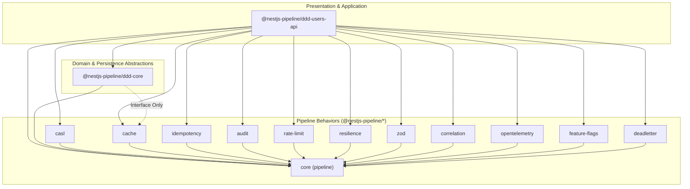
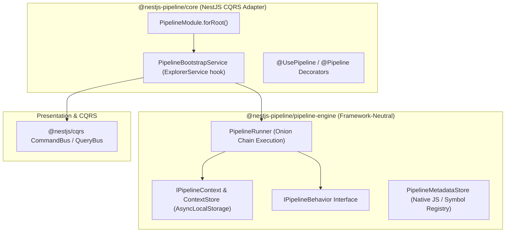
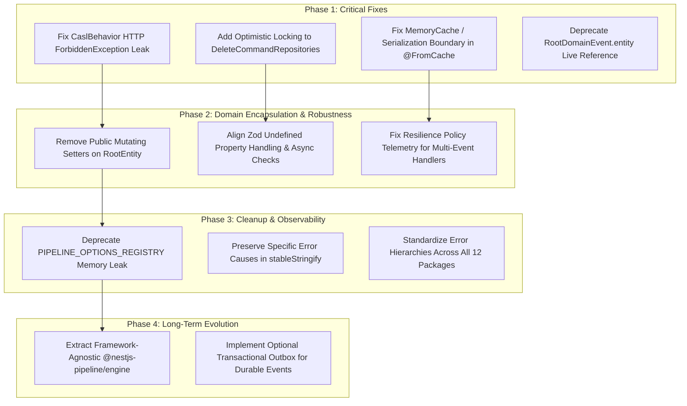

# Repository-Wide Architectural and Code Review: `nestjs-pipeline`

**Date:** September 2026  
**Target:** `nestjs-pipeline` monorepo (`@nestjs-pipeline/*`, `@nestjs-pipeline/ddd-core`, `@nestjs-pipeline/ddd-users-api`)  
**Scope:** Architecture, Correctness, Concurrency, Security, Clean Architecture / DDD boundaries, CQRS purity, Package ergonomics, Test suite robustness.  
**Repository State:** 74 test files, 354 tests passing; strict zero-code-change review.

---

## 1. Executive Summary & Repository Architecture Map

### 1.1 Health & Maturity Assessment

The `nestjs-pipeline` repository is a mature, well-engineered TypeScript/NestJS monorepo providing MediatR-style pipeline behaviors for `@nestjs/cqrs`, an opinionated DDD/Clean Architecture core, and an enterprise reference application (`users-api`). 

The codebase exhibits high craftsmanship:
- Zero-allocation fast paths in [pipeline.bootstrap.service.ts](file:///home/aristotelis/Source/nestjs-pipeline/packages/pipeline/src/services/pipeline.bootstrap.service.ts).
- Deterministic, recursive canonical JSON serialization with cycle detection in [stableStringify.ts](file:///home/aristotelis/Source/nestjs-pipeline/packages/pipeline/src/helpers/stableStringify.ts).
- Fail-closed multi-tenant security partitioning across caching, idempotency, and session contexts.
- Strict event-publication lifecycle via `CommandBaseHandler`.

However, our deep, repository-wide review uncovered several **material architectural leaks, concurrency hazards, and subtle encapsulation violations** that compromise framework neutrality, data integrity under concurrent loads, and DDD invariants.

| Dimension | Rating | Summary Assessment |
| :--- | :---: | :--- |
| **Clean Architecture & DDD** | **B+** | Strong layer separation in general, but `RootEntity` leaks public mutating setters, and `RootDomainEvent` exposes live mutable aggregate instances. |
| **CQRS Purity** | **A-** | Excellent separation of Command and Query paths with dedicated repositories; small gap in delete concurrency verification. |
| **Pipeline Core Architecture** | **A** | Elegant prototype-wrapping onion model with AsyncLocalStorage propagation; minor memory hazard in legacy static registries. |
| **Framework Decoupling** | **B** | Core pipeline behavior contracts are tightly coupled to NestJS DI tokens and `@nestjs/common` types; HTTP exceptions leak inside pipeline behaviors. |
| **Concurrency & Data Integrity** | **B+** | Optimistic locking implemented on updates, but omitted on aggregate deletions; cache rehydration type-aliasing bug in memory cache. |
| **Test Quality & Ergonomics** | **A-** | 354 passing tests with SWC metadata emit; high mock precision, but reliance on synthetic in-memory mocks masks persistence serialization differences. |

---

### 1.2 Monorepo Architecture & Dependency Graph

The repository is divided into three distinct conceptual layers:



### 1.3 Core Invariant Compliance Matrix

| Invariant / Architectural Rule | Target | Compliance | Notes |
| :--- | :--- | :---: | :--- |
| **1. Repositories depend on interfaces, not ORMs** | CQRS Handlers | **PASS** | Handlers inject `USER_COMMAND_REPOSITORY` / `USER_QUERY_REPOSITORY` interfaces. |
| **2. Framework-neutral errors in domain/application** | Domain / Pipeline | **FAIL** | `CaslBehavior` directly throws NestJS `ForbiddenException`. |
| **3. Cross-cutting concerns in Pipeline behaviors** | Handlers | **PASS** | Logging, tracing, audit, idempotency, rate-limiting are fully encapsulated in behaviors. |
| **4. Post-load entity-level authorization** | Application Handlers | **PASS** | `CaslAuthorizer` runs after aggregate load; field-level filtering applies to domain objects. |
| **5. Fail-closed security keys** | Cache / Idempotency | **PASS** | Multi-tenant and user principal dimensions are required; no silent fallbacks to default namespace. |
| **6. Aggregate mutation via domain methods** | Domain Aggregates | **WARN** | Encapsulation breached by public setters on `RootEntity` (`set id`, `set createdAt`, `set updatedAt`). |
| **7. Infrastructure behind ports/adapters** | Application Core | **PASS** | Keyv, LibSQL, PostgreSQL, and Cockatiel are wrapped behind application ports. |
| **8. Event publication via `CommandBaseHandler`** | Command Handlers | **PASS** | Aggregate domain events published strictly after persistence via base handler. |
| **9. Minimal private framework coupling** | Core Pipeline | **PASS** | Accepted trade-off: `@nestjs/cqrs` `ExplorerService` prototype wrapping is well-isolated and tested. |
| **10. No assumption of transactional outbox** | Event Bus | **PASS** | Repository documents in-memory bus trade-off, but distributed consistency lacks an outbox mechanism. |

---

## 2. DDD, Clean Architecture, and CQRS Adherence Analysis

### 2.1 Boundary Enforcement
- **Domain Layer (`ddd/core/domain`, `ddd/users-api/src/*/domain`)**: Contains aggregate roots, entities, domain events, domain errors, and value objects. Correctly free of NestJS dependencies, HTTP decorators, and ORM decorators (MikroORM entity definitions in `users-api` are maintained in separate persistence classes or isolated schema definitions).
- **Application Layer (`ddd/core/application`, `ddd/users-api/src/*/cqrs`)**: Houses CQRS commands, queries, and handlers. Adheres strictly to dependency inversion; handlers inject abstract repository tokens (`USER_COMMAND_REPOSITORY`).
- **Persistence & Infrastructure Layer (`ddd/users-api/src/persistence`, `src/*/persistence`)**: Concrete implementations of repositories (`CreateUserCommandRepository`, `GetUserQueryRepository`), MikroORM schemas, migrations, and cache adapters (`MikroOrmCache`, `MemoryCache`).
- **Presentation Layer (`ddd/users-api/src/*/controllers`)**: HTTP controllers, Fastify/Express session guards, and filters (`DomainExceptionFilter`, `UnauthorizedActionFilter`).

### 2.2 Domain Model Encapsulation & Rehydration
- **Aggregate Integrity**: Aggregate roots (`User`, `Role`, `Auth`) encapsulate business rules (e.g., `user.changeEmail()`, `user.changeUsername()`, `user.suspend()`).
- **Encapsulation Defect**: [root.entity.ts](file:///home/aristotelis/Source/nestjs-pipeline/ddd/core/domain/models/root.entity.ts#L215-L231) defines public setters for `id`, `createdAt`, and `updatedAt`. While introduced to appease ORM hydration, these violate aggregate encapsulation by allowing external code to mutate immutable identity properties directly.
- **Domain Event Immutability**: [root-domain.event.ts](file:///home/aristotelis/Source/nestjs-pipeline/ddd/core/domain/events/root-domain.event.ts#L174) performs a deep-clone and freeze on `payload`, but holds a raw `public readonly entity: T` reference. Handlers subscribing asynchronously to domain events can observe subsequent mutations made to the in-memory aggregate instance, violating event sourcing and DDD principles.

### 2.3 CQRS Purity & Repository Segregation
- **Command / Query Segregation**: Excellent segregation. Command repositories (`CreateUserCommandRepository`, `UpdateUserCommandRepository`, `DeleteUserCommandRepository`) are segregated from Query repositories (`GetUserQueryRepository`, `FindUserQueryRepository`).
- **Command Return Signatures**: Commands return domain snapshots (`UserSnapshot`) or `void`/`null`, not live domain aggregate instances. This prevents callers from mutating aggregates outside command transactions.
- **Concurrency Gap in Deletions**: While `UpdateUserCommandRepository` asserts aggregate version matches `user.getExpectedVersion()`, `DeleteUserCommandRepository` executes `nativeDelete` without an optimistic lock check, creating a lost-update concurrency hazard on concurrent updates and deletes.

---

## 3. Categorized In-Depth Findings

---

### Finding 1: Direct `HttpException` (`ForbiddenException`) Thrown Inside Pipeline Behavior
- **Severity**: **Critical**
- **Category**: Leaky Abstraction / Architecture Violation
- **Package**: `@nestjs-pipeline/casl`
- **Location**: [casl.behavior.ts](file:///home/aristotelis/Source/nestjs-pipeline/packages/pipeline-casl/src/casl.behavior.ts#L526), [casl.behavior.ts](file:///home/aristotelis/Source/nestjs-pipeline/packages/pipeline-casl/src/casl.behavior.ts#L713)

#### Current Design & Intent
`CaslBehavior` intercepts incoming commands, queries, and events to check authorization policies against `@UseAbility()` declarations. When authorization fails or the user context is missing, it executes:
```ts
// packages/pipeline-casl/src/casl.behavior.ts:526 & 713
throw new ForbiddenException(
  `Access denied: missing ability for action "${firstFailed.action}" on subject "${subjectName}".`,
);
```
`ForbiddenException` is imported directly from `@nestjs/common`.

#### Architectural & Operational Impact
1. **Violation of Architectural Rule 4 & 2**: Violates rule 4 of `.agents/skills/nestjs-pipeline-architecture/SKILL.md` ("Do not throw Nest HttpException subclasses from domain or application/CQRS code").
2. **Coupling to HTTP Transport**: The pipeline is designed to execute commands and queries regardless of transport (HTTP, WebSocket, BullMQ queue worker, Kafka consumer, CLI). Throwing an HTTP 403 `ForbiddenException` in a background worker causes queue processors or gRPC adapters to catch HTTP exceptions rather than domain/application-neutral exceptions.
3. **Inconsistency with Package and Repository Conventions**: `@nestjs-pipeline/casl` already defines [unauthorized-action.exception.ts](file:///home/aristotelis/Source/nestjs-pipeline/packages/pipeline-casl/src/unauthorized-action.exception.ts), which extends standard JavaScript `Error`. Furthermore, all other behavior packages (`feature-flags`, `rate-limit`, `idempotency`, `zod`) throw framework-neutral `Error` subclasses (`FeatureDisabledError`, `RateLimitExceededError`, `IdempotencyConflictError`, `ZodValidationError`). `CaslBehavior` is the lone violator.

#### Concrete Refactoring Direction
Replace `ForbiddenException` with `UnauthorizedActionException` (or a dedicated `ForbiddenActionException extends Error`) inside `CaslBehavior`:

```ts
// packages/pipeline-casl/src/casl.behavior.ts
import { UnauthorizedActionException } from './unauthorized-action.exception';

// Inside handle():
if (!contextUser) {
  throw new UnauthorizedActionException(
    'Access denied: user context is required but was not resolved.',
  );
}

// And on failed ability check:
throw new UnauthorizedActionException(
  `Access denied: missing ability for action "${firstFailed.action}" on subject "${subjectName}".`,
);
```

At the presentation boundary (HTTP), [unauthorized-action.filter.ts](file:///home/aristotelis/Source/nestjs-pipeline/ddd/users-api/src/common/filters/unauthorized-action.filter.ts) already maps `UnauthorizedActionException` to an HTTP 403 response.

#### Migration & Backward Compatibility
- **Consumers**: Any custom exception filter or test catching `ForbiddenException` should be migrated to catch `UnauthorizedActionException`.
- Provide a transitional export or custom error mapper configuration in `CaslModuleOptions` if legacy consumers depend on `ForbiddenException`.

#### Verification Plan
- Update [casl.behavior.spec.ts](file:///home/aristotelis/Source/nestjs-pipeline/packages/pipeline-casl/src/casl.behavior.spec.ts) and [casl.behavior.integration.spec.ts](file:///home/aristotelis/Source/nestjs-pipeline/packages/pipeline-casl/src/casl.behavior.integration.spec.ts) to assert `expect(promise).rejects.toThrow(UnauthorizedActionException)`.
- Verify `users-api` E2E tests properly map the error to HTTP 403 via `UnauthorizedActionFilter`.

---

### Finding 2: Unconditional Deletion Without Optimistic Lock Concurrency Check
- **Severity**: **High**
- **Category**: Correctness / Concurrency
- **Package**: `@nestjs-pipeline/ddd-users-api`
- **Location**: [delete-user.command-repository.ts](file:///home/aristotelis/Source/nestjs-pipeline/ddd/users-api/src/users/persistence/delete-user.command-repository.ts#L44-L51), [delete-role.command-repository.ts](file:///home/aristotelis/Source/nestjs-pipeline/ddd/users-api/src/roles/persistence/delete-role.command-repository.ts#L43-L49)

#### Current Design & Intent
In `UpdateUserCommandRepository`, optimistic concurrency is strictly enforced:
```ts
// update-user.command-repository.ts:40-57
const affected = await this.store.em.nativeUpdate(
  User,
  { id: user.id, version: user.getExpectedVersion() },
  { username: user.username, ... }
);
if (affected === 0) {
  throw OptimisticLockError.lockFailedVersionMismatch(...);
}
```
However, in `DeleteUserCommandRepository` and `DeleteRoleCommandRepository`:
```ts
// delete-user.command-repository.ts:44-51
async save(user: User): Promise<null> {
  try {
    await this.store.em.nativeDelete(User, user.id);
    return null;
  } catch (error) {
    throw mapPersistenceError(error, `deleting User ${user.id}`);
  }
}
```

#### Architectural & Operational Impact
1. **Lost Updates Under Concurrent Execution**: If User A reads User at `version: 1` and issues a `DeleteUserCommand`, while User B concurrently updates User to `version: 2` (e.g., modifying security-sensitive roles or billing details), the delete repository issues `nativeDelete(User, user.id)` without checking the version.
2. User B's update is destroyed, or User A deletes an aggregate that has been modified since it was loaded into memory.
3. In distributed and multi-tenant architectures, deleting an aggregate is a mutating state transition that must assert the aggregate version matches `user.getExpectedVersion()`.

#### Concrete Refactoring Direction
Update `DeleteUserCommandRepository` (and `DeleteRoleCommandRepository`) to pass `{ id: user.id, version: user.getExpectedVersion() }` to `nativeDelete` and verify the affected row count:

```ts
// ddd/users-api/src/users/persistence/delete-user.command-repository.ts
async save(user: User): Promise<null> {
  try {
    const affected = await this.store.em.nativeDelete(User, {
      id: user.id,
      version: user.getExpectedVersion(),
    });

    if (affected === 0) {
      const exists = await this.store.em.findOne(
        User,
        { id: user.id },
        { refresh: true },
      );
      if (exists) {
        throw OptimisticLockError.lockFailedVersionMismatch(
          user,
          user.getExpectedVersion(),
          exists.version,
        );
      }
      throw OptimisticLockError.lockFailedEntityNotFound(
        user,
        user.getExpectedVersion(),
      );
    }

    return null;
  } catch (error) {
    if (error instanceof OptimisticLockError) throw error;
    throw mapPersistenceError(error, `deleting User ${user.id}`);
  }
}
```

#### Verification Plan
- Create a concurrency unit test in `delete-user.command-repository.spec.ts` asserting that attempting to delete when the persisted version differs throws `OptimisticLockError`.
- Verify `DomainExceptionFilter` maps `OptimisticLockError` to HTTP 409 Conflict.

---

### Finding 3: Public Mutating Setters on Immutable Identity Fields in `RootEntity`
- **Severity**: **High**
- **Category**: Domain Model Encapsulation / DDD Purity
- **Package**: `@nestjs-pipeline/ddd-core`
- **Location**: [root.entity.ts](file:///home/aristotelis/Source/nestjs-pipeline/ddd/core/domain/models/root.entity.ts#L215-L231)

#### Current Design & Intent
In `RootEntity<TSnapshot>`, property accessors are declared as:
```ts
get id(): string { return this._id; }
set id(value: string) { this._id = RootEntity.normalizeId(value); }

get createdAt(): Date { return new Date(this._createdAt); }
set createdAt(value: Date | string) { this._createdAt = RootEntity.normalizeDate(value); }

get updatedAt(): Date { return new Date(this._updatedAt); }
set updatedAt(value: Date | string) { this._updatedAt = RootEntity.normalizeDate(value); }
```
The documented intent was to allow ORM property reflection (`accessor: true`) during hydration.

#### Architectural & Operational Impact
1. **Encapsulation Breach**: In Domain-Driven Design, an Aggregate Root's identity (`id`) is immutable once created. Having a public `set id(value)` allows arbitrary application or presentation code to change an aggregate's identity (e.g., `user.id = 'new-id'`), corrupting identity invariants.
2. **Bypassing Audit & Versioning**: Mutating `createdAt` and `updatedAt` directly bypasses the `onUpdate()` lifecycle hook and version incrementing.
3. Rule 6 of `AGENTS.md` explicitly demands: *"Mutate aggregates through factories/domain methods, not direct setters or synthetic snapshots constructed only to trigger persistence."* Having public setters directly on `RootEntity` encourages anti-pattern mutations.

#### Concrete Refactoring Direction
1. Remove public setters for `id` and `createdAt`.
2. Keep `updatedAt` mutated only via `protected onUpdate()`.
3. For ORM rehydration, provide a protected or static rehydration hook, or define a dedicated internal symbol / factory method:

```ts
// ddd/core/domain/models/root.entity.ts
export abstract class RootEntity<TSnapshot extends Partial<RootEntitySnapshot>> {
  // Read-only public getters
  get id(): string {
    return this._id;
  }

  get createdAt(): Date {
    return new Date(this._createdAt);
  }

  get updatedAt(): Date {
    return new Date(this._updatedAt);
  }

  // Rehydration hook for persistence mappers / ORM reflection
  protected static rehydrateBaseProperties<T extends RootEntity<any>>(
    instance: T,
    id: string,
    version: number,
    createdAt: Date | string,
    updatedAt: Date | string,
  ): void {
    instance._id = RootEntity.normalizeId(id);
    instance._persistedVersion = RootEntity.normalizeVersion(version);
    instance._version = instance._persistedVersion;
    instance._createdAt = RootEntity.normalizeDate(createdAt);
    instance._updatedAt = RootEntity.normalizeDate(updatedAt);
  }
}
```

#### Migration & Backward Compatibility
Any persistence mappers relying on `user.id = snapshot.id` should use `Aggregate.fromJSON(snapshot)` (which is already the recommended repository pattern).

---

### Finding 4: Live Mutable Aggregate Reference Carried by Domain Events
- **Severity**: **High**
- **Category**: Concurrency / Leaky Abstraction
- **Package**: `@nestjs-pipeline/ddd-core`
- **Location**: [root-domain.event.ts](file:///home/aristotelis/Source/nestjs-pipeline/ddd/core/domain/events/root-domain.event.ts#L174-L180)

#### Current Design & Intent
`RootDomainEvent` is designed to be published after aggregate changes:
```ts
export class RootDomainEvent<
  T = RootEntity<Partial<RootEntitySnapshot>>,
  TPayload = InferPayload<T>,
> extends DomainEvent {
  public readonly entity: T;
  public readonly payload: Readonly<TPayload>;

  protected constructor(entity: T, payload?: TPayload) {
    super();
    this.entity = entity;
    ...
    this.payload = deepCloneAndFreeze(rawPayload);
  }
}
```
The author carefully recognized race conditions in async consumers and implemented `deepCloneAndFreeze` for `payload`. However, `this.entity = entity;` retains a direct reference to the live, mutable aggregate root instance.

#### Architectural & Operational Impact
1. **Temporal Coupling and Race Conditions**: If an event handler processes `RootDomainEvent` asynchronously or dispatches background jobs, reading `event.entity` accesses the *current live in-memory state* of the aggregate rather than the state at the moment the event occurred.
2. If the aggregate is modified again later in the same transaction or request, `event.entity.someField` reflects the mutated value, not the event-time value.
3. Event consumers could inadvertently call mutating domain methods on `event.entity` (e.g. `event.entity.suspend()`), causing untracked aggregate mutations outside a command handler.

#### Concrete Refactoring Direction
1. Deprecate direct access to `event.entity` in favor of `event.payload` (which is already frozen and self-contained).
2. If aggregate identification is needed, expose immutable primitive identifiers (`aggregateId: string`, `aggregateName: string`, `version: number`).
3. For backward compatibility, make `entity` a getter that returns a frozen clone or issue a deprecation warning:

```ts
// ddd/core/domain/events/root-domain.event.ts
export class RootDomainEvent<
  T = RootEntity<Partial<RootEntitySnapshot>>,
  TPayload = InferPayload<T>,
> extends DomainEvent {
  public readonly aggregateId: string;
  public readonly aggregateVersion: number;
  public readonly payload: Readonly<TPayload>;

  /** @deprecated Consume `event.payload` instead of the live aggregate reference. */
  public get entity(): Readonly<T> {
    return Object.freeze(this._entityRef);
  }
  private readonly _entityRef: T;

  protected constructor(entity: T, payload?: TPayload) {
    super();
    this._entityRef = entity;
    this.aggregateId = (entity as any)?.id;
    this.aggregateVersion = (entity as any)?.version;
    this.payload = deepCloneAndFreeze(rawPayload);
  }
}
```

---

### Finding 5: Caching Hydration Inconsistency Between `MemoryCache` and `MikroOrmCache`
- **Severity**: **High**
- **Category**: Correctness / Data Integrity
- **Package**: `@nestjs-pipeline/ddd-users-api` & `@nestjs-pipeline/ddd-core`
- **Location**: [memory.cache.ts](file:///home/aristotelis/Source/nestjs-pipeline/ddd/users-api/src/persistence/cache/memory.cache.ts#L45-L55), [mikro-orm.cache.ts](file:///home/aristotelis/Source/nestjs-pipeline/ddd/users-api/src/persistence/cache/mikro-orm.cache.ts#L35-L42), [FromCache.ts](file:///home/aristotelis/Source/nestjs-pipeline/ddd/core/persistence/decorators/FromCache.ts#L50-L75), [get-user.query-repository.ts](file:///home/aristotelis/Source/nestjs-pipeline/ddd/users-api/src/users/persistence/get-user.query-repository.ts#L50-L60)

#### Current Design & Intent
In `GetUserQueryRepository.find(query)`:
```ts
@FromCache<UserSnapshot, User>(
  (query) => filterCacheKey(User.aggregateName, query),
  (cached) => User.fromJSON(cached as UserSnapshot),
)
async find(query: GetUserQuery): Promise<User | null> {
  const user = await this.store.em.findOne(User, { id: query.id });
  return user ? User.fromJSON(user.toJSON()) : null;
}
```
When `find()` completes, `@FromCache` caches the method's return value (`User` instance) in `this.cache`.
- `MikroOrmCache` (backed by Keyv / Redis) serializes the object to JSON (`JSON.stringify(user)`). When read back from Redis, `cached` is a plain JavaScript object matching `UserSnapshot`.
- `MemoryCache` (used in dev, local testing, and in-memory fallback) stores the raw object reference `this.store.set(key, value)`. When read back, `cached` is the *already-instantiated `User` object*, not a `UserSnapshot`!

#### Architectural & Operational Impact
1. When `MemoryCache` returns the raw `User` instance, `@FromCache` invokes:
   `User.fromJSON(cached as UserSnapshot)`
   `User.fromJSON` expects `{ id, username, email, version, createdAt, updatedAt }`. But on a `User` class instance, the version is stored on `_version` and `_persistedVersion`, while `version` is a getter!
2. If `JSON.parse(JSON.stringify(cached))` is not guaranteed, in-memory caching causes reference aliasing: modifications to the returned object mutate the cached object directly.
3. Unit tests using `MemoryCache` test a fundamentally different code path than production environments running Redis.

#### Concrete Refactoring Direction
Enforce JSON deep cloning/serialization at the `MemoryCache` boundary so it behaves identically to distributed caches:

```ts
// ddd/users-api/src/persistence/cache/memory.cache.ts
export class MemoryCache<T> implements ICache<T> {
  private readonly store = new Map<string, string>(); // Store as serialized JSON string

  async get(key: string): Promise<T | null> {
    const raw = this.store.get(key);
    if (!raw) return null;
    return JSON.parse(raw) as T;
  }

  async set(key: string, value: T, ttl?: number): Promise<void> {
    this.store.set(key, JSON.stringify(value));
  }
}
```

#### Verification Plan
- Add a test in `memory.cache.spec.ts` ensuring that mutating an object returned from `cache.get()` does not mutate the value returned by subsequent `cache.get()` calls.
- Run `get-user.query-repository.spec.ts` with `MemoryCache` verifying that `@FromCache` with `hydrate: true` properly rehydrates version and timestamps.

---

### Finding 6: Asymmetric Validation & Async Schema Hazard in `createZodRequest`
- **Severity**: **Medium**
- **Category**: Correctness / Package Ergonomics
- **Package**: `@nestjs-pipeline/zod`
- **Location**: [create-zod-request.ts](file:///home/aristotelis/Source/nestjs-pipeline/packages/pipeline-zod/src/create-zod-request.ts#L120-L137), [zod-validation.behavior.ts](file:///home/aristotelis/Source/nestjs-pipeline/packages/pipeline-zod/src/zod-validation.behavior.ts#L176-L184)

#### Current Design & Intent
`createZodRequest` allows commands and queries to be defined from Zod schemas:
```ts
// create-zod-request.ts:120-137
const result = schema.safeParse(input);
if (result.data && typeof result.data === 'object') {
  for (const [key, value] of Object.entries(result.data)) {
    if (value !== undefined) {
      Object.defineProperty(this, key, { value, writable: true, enumerable: true, configurable: true });
    }
  }
}
```
Meanwhile, `ZodValidationBehavior.handle` runs when the command reaches the pipeline:
```ts
// zod-validation.behavior.ts:148, 176
const result = await schema.safeParseAsync(context.request);
...
defineEnumerableDataProperties(context.request, result.data);
```
Where `defineEnumerableDataProperties` copies **all** keys from `result.data`, including those where `value === undefined`.

#### Architectural & Operational Impact
1. **Property Shape Inconsistency**: If a command is constructed with `{ department: undefined }`, `new CreateUserCommand(...)` omits `department` from `this`. Later, when `ZodValidationBehavior` executes, it sets `department: undefined` on `context.request`. Downstream handlers checking `'department' in command` observe inconsistent behavior depending on whether the command ran through the pipeline behavior or was handled directly in tests.
2. **Synchronous Constructor Crash on Async Schemas**: `createZodRequest`'s constructor executes `schema.safeParse(input)`. If a developer adds an asynchronous refinement (e.g. `z.string().refine(async (val) => checkUniqueness(val))`), `new MyCommand(input)` throws an unhandled Zod runtime error: `"Synchronous parse encountered promise. Use .safeParseAsync instead."` before the command even enters the pipeline!

#### Concrete Refactoring Direction
1. Align property assignment between `createZodRequest` and `ZodValidationBehavior` (treat `undefined` properties identically).
2. Explicitly validate in `createZodRequest` that schemas passed to synchronous constructors do not contain async refinements, or document that async schemas must use static `parseAsync()` factory methods.

---

### Finding 7: Resilience Policy Factory Static Context Binding Corrupts Event Telemetry
- **Severity**: **Medium**
- **Category**: Telemetry / Observability
- **Package**: `@nestjs-pipeline/resilience`
- **Location**: [policy-factory.ts](file:///home/aristotelis/Source/nestjs-pipeline/packages/pipeline-resilience/src/helpers/policy-factory.ts#L146), [resilience.behavior.ts](file:///home/aristotelis/Source/nestjs-pipeline/packages/pipeline-resilience/src/resilience.behavior.ts#L102-L117)

#### Current Design & Intent
In `ResilienceBehavior`:
```ts
// resilience.behavior.ts:102-117
private resolvePolicy(context: IPipelineContext): AnyPolicy | null {
  const cached = this.policyCache.get(context.handlerType);
  if (cached !== undefined) return cached;
  ...
  const policy = effective
    ? buildResiliencePolicy(effective, {
        logger: this.logger,
        requestName: context.requestName,
        handlerName: context.handlerName,
      })
    : null;
  this.policyCache.set(context.handlerType, policy);
  return policy;
}
```
And in `policy-factory.ts`:
```ts
// policy-factory.ts:146
policy.onRetry((reason) => {
  ctx.logger?.warn?.(
    `[resilience] retrying ${ctx.requestName} → ${ctx.handlerName} ` + ...
  );
});
```

#### Architectural & Operational Impact
1. In `@nestjs/cqrs`, an `@EventsHandler(OrderCreatedEvent, OrderCancelledEvent)` can handle **multiple distinct event types**.
2. When the first event (`OrderCreatedEvent`) triggers the handler, the policy is created and cached against `context.handlerType`. `ctx.requestName` is captured in the closure as `'OrderCreatedEvent'`.
3. When `OrderCancelledEvent` later triggers the handler and encounters a failure requiring retry, the logged message outputs:
   `[resilience] retrying OrderCreatedEvent → MultiOrderEventHandler (attempt 2/3)...`
4. This produces misleading production telemetry and logs during incident triage.

#### Concrete Refactoring Direction
Do not bake static `requestName` into the cached policy closure. Instead, leverage Cockatiel's execution context or a per-execution logger delegate:

```ts
// packages/pipeline-resilience/src/helpers/policy-factory.ts
policy.onRetry((reason, context) => {
  const requestName = (context as any)?.requestName ?? ctx.handlerName;
  ctx.logger?.warn?.(
    `[resilience] retrying ${requestName} → ${ctx.handlerName} ` + ...
  );
});
```
And pass `requestName` in `policy.execute({ requestName: context.requestName }, ...)` inside `ResilienceBehavior.handle()`.

---

### Finding 8: Memory Leak Hazard in Static `PIPELINE_OPTIONS_REGISTRY`
- **Severity**: **Medium**
- **Category**: Performance / Memory Management
- **Package**: `@nestjs-pipeline/core`
- **Location**: [pipeline.decorator.ts](file:///home/aristotelis/Source/nestjs-pipeline/packages/pipeline/src/decorators/pipeline.decorator.ts#L63-L79)

#### Current Design & Intent
`pipeline.decorator.ts` maintains:
```ts
export const PIPELINE_OPTIONS_REGISTRY = new Map<
  string,
  Map<string, Record<string, unknown>>
>();
```
It is explicitly marked `@deprecated` with the comment: *"It is not used for pipeline execution; bootstrap reads reflection metadata from discovered CQRS handlers."*

#### Architectural & Operational Impact
1. **Dead Memory Accumulation**: Despite being unused during bootstrap and execution, `@Pipeline(...)` decorators unconditionally insert entries into this global `Map` keyed by `target.name`.
2. In watch-mode, serverless warm starts, dynamic module loading, or multi-tenant plugins, this static Map holds references indefinitely unless `clearPipelineOptionsRegistry()` is manually called.
3. Class-name collisions between different packages overwrite entries silently.

#### Concrete Refactoring Direction
1. Replace `PIPELINE_OPTIONS_REGISTRY` with a no-op or gate its population behind an explicit debugging flag (e.g. `process.env.DEBUG_PIPELINE_REGISTRY === 'true'`).
2. Mark for removal in the next major version.

---

### Finding 9: Error Context & Cause Suppression in `stableStringify`
- **Severity**: **Low**
- **Category**: Ergonomics / Debuggability
- **Package**: `@nestjs-pipeline/core`
- **Location**: [stableStringify.ts](file:///home/aristotelis/Source/nestjs-pipeline/packages/pipeline/src/helpers/stableStringify.ts#L178-L184)

#### Current Design & Intent
[stableStringify.ts](file:///home/aristotelis/Source/nestjs-pipeline/packages/pipeline/src/helpers/stableStringify.ts) implements an exceptional canonical serializer that checks for BigInt, symbols, functions, non-finite numbers, and circular references.
However:
```ts
export function stableStringify(value: unknown): string {
  try {
    return JSON.stringify(toStrictJsonValue(value, true));
  } catch {
    throw new TypeError(
      'stableStringify requires an acyclic JSON-serializable value.',
    );
  }
}
```

#### Architectural & Operational Impact
`toStrictJsonValue` provides rich, pinpoint error messages (e.g. `"Circular reference detected."`, `"BigInt values are not JSON-serializable."`). The `catch` block discards this information and throws a generic `TypeError` without `{ cause: error }`. When cache key generation fails in production, developers cannot determine whether it was a BigInt, circular reference, or function.

#### Concrete Refactoring Direction
Preserve the specific message and chain the error cause:
```ts
export function stableStringify(value: unknown): string {
  try {
    return JSON.stringify(toStrictJsonValue(value, true));
  } catch (error) {
    throw new TypeError(
      error instanceof Error ? error.message : 'stableStringify requires an acyclic JSON-serializable value.',
      { cause: error },
    );
  }
}
```

---

### Finding 10: In-Memory EventBus Semantic Drift & Lack of Durable Outbox
- **Severity**: **Medium**
- **Category**: Architecture / Distributed Consistency
- **Package**: `@nestjs-pipeline/ddd-core` & `@nestjs-pipeline/core`
- **Location**: [command-base.handler.ts](file:///home/aristotelis/Source/nestjs-pipeline/ddd/core/application/command-base.handler.ts#L60-L75), [AGENTS.md](file:///home/aristotelis/Source/nestjs-pipeline/AGENTS.md#L45)

#### Current Design & Intent
`CommandBaseHandler` provides aggregate event publishing:
```ts
const result = await this.executeCommand(command);
const events = this.collectEvents(aggregate);
await this.publishEvents(events);
```
`AGENTS.md` Rule 10 states: *"Do not assume Nest's in-memory EventBus is a transactional outbox. Durable delivery requires an explicit architecture decision."*

#### Architectural & Operational Impact
1. While documented as an intentional trade-off, this is the most critical reliability hazard in production systems using this architecture.
2. If `save()` commits to the database, but the Node.js process crashes, encounters an OOM error, or network fails before `publishEvents()` completes, domain events are permanently lost.
3. Downstream read models (projections, Redis cache invalidation, audit sinks) will fall out of sync with the primary SQL database.

#### Concrete Refactoring Direction
Provide an optional `ITransactionalOutbox` port in `@nestjs-pipeline/ddd-core`:
- If an outbox adapter is registered, `publishEvents` writes events to the outbox table within the same transaction as the aggregate state.
- A background worker polls or streams the outbox table to the EventBus or message broker.

---

## 4. Architecture Improvement & Framework Decoupling Blueprint

Currently, `@nestjs-pipeline/core` is tightly coupled to `@nestjs/common` and `@nestjs/core` via `Type<T>`, `Injectable()`, `Module()`, and `ExplorerService`.

### 4.1 Target Framework-Agnostic Core Architecture

To achieve true clean architecture and enable pipeline behaviors in non-Nest contexts (e.g., pure Node.js services, Fastify plugins, standalone Lambda handlers, or other DI containers), we recommend decoupling the pipeline engine into two layers:



### 4.2 Decoupling Strategy

1. **Phase 1: Pure TypeScript Interfaces**
   - Extract `IPipelineBehavior`, `IPipelineContext`, `NextDelegate`, and `PipelineContextStore` into framework-neutral types that depend only on standard JavaScript primitives and Node's `AsyncLocalStorage`.
   - Remove `@nestjs/common` dependencies (such as `Type<T>` -> `new (...args: any[]) => any`).

2. **Phase 2: Framework-Neutral Pipeline Runner**
   - Implement `executePipeline(context: IPipelineContext, behaviors: IPipelineBehavior[], handler: () => Promise<T>): Promise<T>`.
   - Keep the existing `PipelineBootstrapService` in `@nestjs-pipeline/core` as the adapter responsible for discovering NestJS CQRS handlers, resolving DI dependencies, and delegating execution to `executePipeline`.

3. **Where Framework Independence is Beneficial vs. Premature**:
   - **Beneficial**: Caching key generation, Zod request parsing, correlation storage, and stable serialization. These are pure algorithms that should never depend on NestJS.
   - **Premature / Unnecessary**: Abstracting away `@nestjs/cqrs` `CommandBus` or Nest's DI container inside the application layer. The repository's stated value proposition is supercharging NestJS CQRS applications; abandoning Nest's DI ergonomics inside the consumer app (`users-api`) would add unnecessary indirection without tangible ROI.

---

## 5. Cross-Package & Test Suite Assessment

### 5.1 Cross-Package Coherence

| Package | Options Pattern | Error Hierarchy | Decorator Ergonomics | Standalone Usability |
| :--- | :--- | :--- | :--- | :--- |
| `core` | `PipelineModuleOptions` | Standard `Error` | `@Pipeline(...)` | High |
| `correlation` | `CorrelationStore` | None | `@WithCorrelation()` | Very High |
| `zod` | Schema in request | `ZodValidationError` | `createZodRequest()` | High |
| `casl` | `CaslModuleOptions` | **Inconsistent (`ForbiddenException`)** | `@UseAbility()` | High |
| `cache` | `CacheBehaviorOptions` | Standard `Error` | Decorator + Behavior | High |
| `idempotency` | `IdempotencyModuleOptions` | `IdempotencyConflictError` | `@Idempotent()` | High |
| `resilience` | `ResilienceBehaviorOptions`| Cockatiel Errors | Behavior options | High |
| `audit` | `AuditModuleOptions` | Standard `Error` | Behavior options | High |
| `rate-limit` | `RateLimitModuleOptions` | `RateLimitExceededError` | Behavior options | High |
| `deadletter` | `DeadLetterModuleOptions` | Standard `Error` | Behavior options | High |
| `feature-flags`| `FeatureFlagsModuleOptions`| `FeatureDisabledError` | Behavior options | High |
| `opentelemetry`| `TelemetryModuleOptions` | Standard `Error` | Behavior options | High |

### 5.2 Test Suite Evaluation
- **Strengths**:
  - Comprehensive unit test coverage: 74 test files and 354 tests pass cleanly across all 12 packages.
  - SWC compilation preserves decorator metadata for Vitest, ensuring fast test cycles without Jest overhead.
  - Excellent concurrency stress tests (e.g. [cache-manager.concurrency.spec.ts](file:///home/aristotelis/Source/nestjs-pipeline/packages/pipeline-cache/src/adapters/cache-manager.concurrency.spec.ts)).
- **Weaknesses**:
  - **In-Memory Mock Aliasing**: Tests heavily utilize `MemoryCache` and in-memory mock repositories. Because `MemoryCache` does not serialize to JSON strings, tests miss serialization edge-cases (such as Date rehydration and version getter vs property serialization).
  - **E2E Container Requirement**: The full E2E test suite requires Docker for Redis and PostgreSQL. When running in environments without Docker socket access, E2E tests cannot run, making high-fidelity unit tests with strict serialization emulation essential.

---

## 6. Prioritized Action Plan



### Phase 1: High-Risk Correctness & Architectural Leaks
1. **Replace `ForbiddenException` in `CaslBehavior`** with `UnauthorizedActionException` to restore transport neutrality.
2. **Add version-checked `nativeDelete` in `DeleteUserCommandRepository`** and `DeleteRoleCommandRepository` to prevent silent lost updates.
3. **Enforce JSON serialization in `MemoryCache`** to ensure in-memory and Redis caches have identical rehydration semantics.
4. **Remove live mutable aggregate reference from `RootDomainEvent`** to protect event consumers from concurrency races.

### Phase 2: Boundary Hardening & Encapsulation
1. **Eliminate public setters on `RootEntity`** for `id`, `createdAt`, and `updatedAt`.
2. **Align Zod request property definition** between constructor and validation behavior, guarding against async refinement crashes.
3. **Decouple `requestName` from cached Cockatiel resilience policies** to prevent telemetry corruption on multi-event handlers.

### Phase 3: Abstraction Cleanup & Performance
1. **Disable or isolate `PIPELINE_OPTIONS_REGISTRY`** to prevent memory accumulation in long-lived or dynamic processes.
2. **Preserve specific error causes in `stableStringify`** to improve cache debugging ergonomics.
3. **Unify behavior options and error hierarchies** across all behavior packages.

### Phase 4: Long-Term Architectural Evolution
1. **Extract `@nestjs-pipeline/engine`** as a pure TypeScript core, retaining `@nestjs-pipeline/core` as the NestJS/CQRS integration adapter.
2. **Introduce an optional Transactional Outbox pattern** to guarantee durable event delivery across distributed boundaries.
